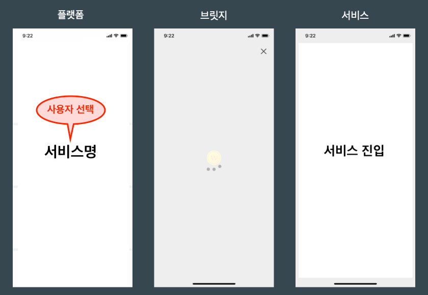
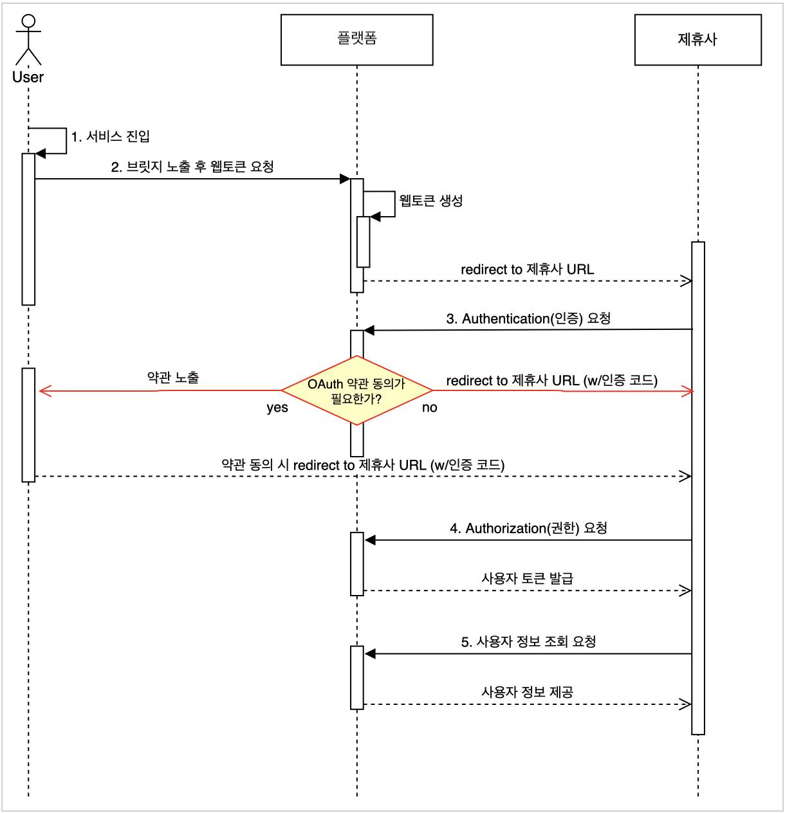
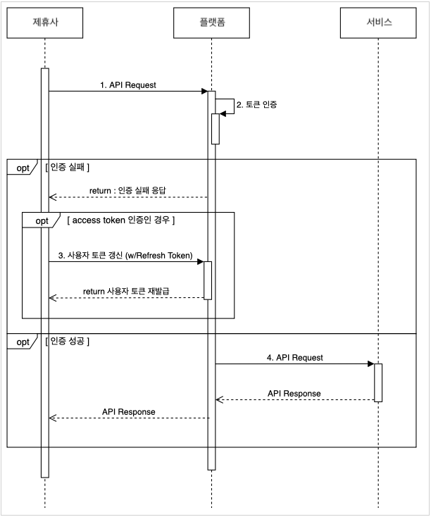
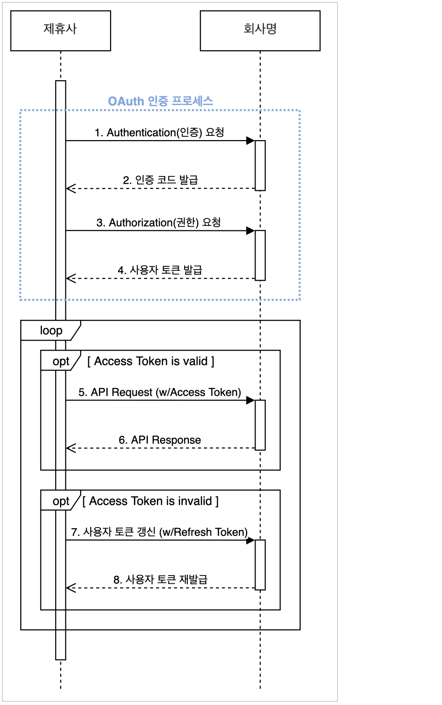

# {플랫폼명} HTTP REST API 설계서

> 배포버전: v1_20210218

- 본 문서는 (주){회사명}의 기밀 자산으로 {플랫폼명} API(이하 "플랫폼 API") 연동과 관련된 표준 가이드 및 연동에 필요한 정보를 제공하기 위하여 작성되었습니다.
- (주){회사명}의 승인 없이 이를 변형하거나 제3자에게 제공 혹은 배포 할 수 없습니다. 또한 (주){회사명}의 사전 승인 없이 "플랫폼 API"를 재가공하거나 재판매하는 등의 활동은 할 수 없습니다.
- (주){회사명}은 이 문서를 작성하면서 현재의 정확하고 완전한 정보를 제공하기 위해 노력하였으나, 오류나 누락이 있을 수 있습니다. 이와 같은 건에 대해 알려주시면 빠른 시일 내에 반영 및 업데이트 하겠습니다.

Copyright © 2021 {회사명} Corp. Confidential and Proprietary. All Rights Reserved.

******

**Table of Contents**

[TOC]

******

## 1. 들어가는 말

### 1.1. 목적

- 본 문서는 {회사명}에서 제공하는 플랫폼과 연동을 위해 필요한 HTTP REST API 설계를 정의합니다.

### 1.2. 대상

- 본 문서는 {플랫폼명} 연동을 구현하는 개발 담당자에게 적합합니다.
- 이 문서를 이해하기 위해서는 다음의 지식을 갖추어야 합니다.
  - HTTP/HTTPS
  - OAuth 2.0

### 1.3. 약속

- {회사명}에서 제공하는 플랫폼은 이 문서에서 `{플랫폼명}`으로 칭합니다.
- 다이어그램에 표기된 `(w/명사)`와 같은 형태는 `with`를 의미합니다.
	- 예를 들어 `(w/가나다)`라고 표기되어 있다면, `with 가나다`라는 의미입니다.
- HTTP 및 OAuth와 관련된 용어는 별도로 해설하지 않습니다.

## 2. 공통사항

### 2.1. 사전 조건

- API 사용을 위해서 아래의 조건이 충족되어야 합니다.
  - 제휴사:
    - {조건 1}
    - {조건 2}
  - 사용자: 서비스에 가입
    - {조건 1}
    - {조건 2}
- 제휴사에서 {회사명} 측에 제공해야할 정보는 다음과 같습니다.
  - **네트워크 연동 방식** : 공중망 / 전용선 / VPN 중 택일
  - **redirect_uri** : 인증 완료 후 목적지 (제휴사 측 웹페이지 URL)
  - **제휴사 서버 정보** : 공인 IP 및 hostname
  - **사용자 정보 조회 시 받을 값** : 이메일 / 이름 / 전화번호 / 통신사 정보 / 생년월일 / 성별 중 선택 (다수 가능)
- 유의사항

> 1. 해당 정보들에 대해 {회사명}에서 **설정이 완료된 후에 연동 진행**이 가능합니다.
>   - 설정에는 제휴사 정보 등록과 네트워크 연동 과정이 포함됩니다.
>   - 제휴사 정보 등록 완료 후 client ID 및 client secret을 받을 수 있습니다.
> 2. **네트워크 연동 방식에 있어 "전용선" 혹은 "VPN"을 사용하실 경우 "네트워크 가이드" 문서를 먼저 검토해야 합니다.**
>   - 기본으로 제공하는 문서가 아니므로 별도로 요청하기 바랍니다.
>   - 전용선이나 VPN 연동 시에는 네트워크 연동에 최대 4주 소요될 수 있습니다.

### 2.2. {회사명} 서버 정보

#### 2.2.1. 통신 플로우

- 방화벽 작업 시 아래 플로우를 참고 바랍니다.

  | 환경 | Source IP | Destination IP | Port |
  |---|-----|-----|---|
  | SANDBOX (dev) | 제휴사 발신용 IP | {회사 수신용 IP} | 443 |
  | PRODUCTION (REAL) | 제휴사 발신용 IP | {회사 수신용 IP} | 443 |

#### 2.2.2. 서버 호스트 정보

- OAUTH 인증

  | 환경 | URL |
  |---|---|
  | SANDBOX (dev) | https://sandbox-oauth.company.com |
  | PRODUCTION (REAL) | https://oauth.company.com |

- 플랫폼 API

  | 환경 | URL |
  |---|---|
  | SANDBOX (dev) | https://sandbox-api.company.com |
  | PRODUCTION (REAL) | https://api.company.com |

### 2.3. API Flow



사용자 입장에서 볼 때의 화면 흐름은 다음과 같습니다.

1. 특정 서비스 선택
2. 브릿지 화면
3. 서비스 진입 (제휴사 웹페이지)

본 장에서는 상기 플로우에 대한 상세 내용을 설명합니다.

> * 필수
>   * 다이어그램은 반드시 숙지하기 바랍니다.
> * 선택
>   * 다이어그램만으로 이해가 어려운 경우, 다이어그램 하단의 설명을 반드시 읽기 바랍니다.

#### 2.3.1. 제휴사 인증 및 사용자 식별

> {플랫폼명}은 제휴사 인증을 위해 OAuth 2.0을 사용합니다.
>
> - OAuth 2.0 자체에 대한 내용이 필요하다면 **Appendix A. OAuth 2.0에 대하여** 항목을 참고해주시기 바랍니다.



*1. 서비스 진입 / 2. 브릿지 노출 후 웹토큰 요청*
  - 사용자가 서비스에 진입하면 브릿지 화면을 만납니다.
  - 이 때 {플랫폼명} 내부적으로 웹 토큰(쿠키) 발급 과정을 거칩니다.
  - 이후 서비스 화면으로 이동합니다.

*3. Authentication(인증) 요청*
  - OAuth 인증 프로세스 첫 단계로, `3.1. 인증 코드 요청`에 해당합니다.
  - 제휴사 ID(client_id)로 제휴사를 식별하고, 브릿지 페이지에서 생성된 웹 토큰으로 사용자의 {회사명} 계정을 식별합니다.
    - 인증을 처음으로 요청한 사용자인 경우, OAuth 인증을 위한 약관 동의를 받습니다.
  - 성공 시 인증 코드와 함께 제휴사 측 URL(redirect_uri)로 이동하게 됩니다.
    - 계정 상태가 비정상일경우 인증 코드가 발급되지 않습니다.

*4. Authorization(권한) 요청*

  - `3.2. 사용자 토큰 발급`에 해당합니다.
  - 3에서 발급받은 인증 코드를 사용자 토큰(Access Token 및 Refresh Token)으로 교환하기 위한 요청입니다.
    - 인증 코드 유효시간(발급 후 1분) 이내에 호출해야 합니다.
  - 제휴사는 액세스 토큰(Access Token) 및 리프레시 토큰(Refresh Token)을 받습니다.
    - 사용자 토큰 발급이 완료되면 사용자 정보 조회 API를 사용할 수 있습니다.
    - 사용자 토큰에 대한 보다 자세한 내용은 `2.4. 사용자 토큰` 항목을 참고 바랍니다.
  - 본 단계까지 완료하면 OAuth 인증 프로세스 완료입니다.

*5. 사용자 정보 조회 요청*
  - `3.4. 사용자 정보 조회`에 해당합니다.
  - {회사명} 사용자 정보가 필요한 경우 요청합니다.
  - 정상 응답을 받은 경우 정보 보관, 로그인 등 제휴사 프로세스를 따릅니다.

#### 2.3.2. 서비스 연동



*1. API Request / 2. 토큰 인증*
  - Authorization은 Bearer 혹은 PARTNER_KEY 방식을 사용합니다. 이는 각 API 명세에 따릅니다.
  - 요청을 받은 {플랫폼명} 서버에서는 Authorization을 수행합니다.
    - 인증 실패 시 인증 실패 응답을 제휴사에 보냅니다.
    - 인증 성공 시 API에 해당하는 서비스로 요청을 전달합니다.

*3. 사용자 토큰 갱신*

  - `3.3. 사용자 토큰 갱신`에 해당합니다.
  - 사용자 토큰(액세스 토큰, 리프레시 토큰)을 갱신해야할 때 호출합니다.
    - 인증 실패한 경우 호출합니다.
    - 그 외 토큰이 만료되었거나 분실한 경우에도 호출할 수 있습니다.
  - 호출할 때 반드시 리프레시 토큰(Refresth Token)이 필요합니다.
    - 만약 리프레시 토큰(Refresth Token) 또한 만료되었다면 Authentication 단계부터 다시 시작해야 합니다.

*4. API Request*
  - 서비스 단에서 요청받은 API를 수행합니다.
  - 수행 결과는 {플랫폼명}을 통해 제휴사에 보냅니다.

### 2.4. 사용자 토큰

OAuth 인증 프로세스가 완료되면 사용자 토큰이 발급됩니다.
- 사용자 토큰은 액세스 토큰(Access Token)과 리프레시 토큰(Refresh Token)으로 구성되어 있습니다.
- 사용자 토큰은 {회사명} 및 {플랫폼명}에서 알 수 없으며, 제휴사에서 관리해야 합니다.
- 사용자 토큰은 `플랫폼 API 사용 권한을 가진 제휴사`를 뜻하는 중요한 키이므로, 외부에 유출되거나 탈취당하지 않도록 유의하기 바랍니다.

#### 2.4.1. 액세스 토큰 (Access Token)

1. 정의: OAuth의 인증 및 권한에 대한 검증을 완료했음을 알려주는 키(Key)
2. 사용: OAuth 인증 완료 이후 액세스 토큰이 필요한 API 호출 시 헤더에 담는 정보
3. 역할: {플랫폼명}이 보호하는 자원에 접근할 때 권한이 있는지 확인
4. 유효시간: 발급 후 24시간 *(상황에 따라 변동 가능)*
5. 갱신 방법: 사용자 토큰 갱신 API 호출 (`3.3. 사용자 토큰 갱신` 항목 참고)

#### 2.4.2. 리프레시 토큰 (Refresh Token)

1. 정의: 액세스 토큰의 재발급이 필요할 때 사용하는 키(Key)
2. 사용: 액세스 토큰 갱신이 필요할 때 해당 API의 파라미터로 전달
3. 역할: 액세스 토큰 재발급을 수행해도 되는지 판단 근거가 되는 값
4. 유효시간: 발급 후 30일 *(정책 혹은 제휴사 요청에 따라 변동 가능)*
5. 갱신 방법: 만료 일자 기준 5일 이내에 사용자 토큰 갱신 API 호출 (`3.3. 사용자 토큰 갱신` 항목 참고)

### 2.5. API 호출 방식

> 모든 API는 HTTP 프로토콜을 기반으로 합니다.

#### 2.5.1. HTTP method

- HTTP method는 GET 혹은 POST를 사용합니다.

   | Method | 사용처 | 호출 방식 |
   |---|---|---|
   | GET | 데이터 조회 | URI + Param (HTTP query string) |
   | POST | 데이터 가공 혹은 삭제 | URI + Body |

- POST 방식으로 전송 시 Content-Type 정의 및 Body 형태는 각 API 명세를 따라주시기 바랍니다.

#### 2.5.2. Authorization

- Authorization은 Bearer 방식을 사용하며, OAuth 인증 과정에서 발급받은 액세스 토큰(Access Token)을 이용합니다.

   ```http
   Authorization: Bearer {access_token}
   ```

#### 2.5.3. Content-Type

- API에 따라 다르므로 반드시 API 명세를 따라주시기 바랍니다.
- Content-Type이 `application/x-www-form-urlencoded`인 경우 파라미터 value에 대해 반드시 **URL encoding**이 필요합니다.
  - (참고) https://www.w3.org/TR/html401/interact/forms.html#h-17.13.4
  - `Appendix B. URL encoding 가이드` 항목에서 URL encoding 방법을 확인할 수 있습니다.

### 2.6. API 응답 방식

- 기본 응답 방식
  - 결과는 HTTP Status Code와 HTTP Body를 통해 나타납니다.
  - HTTP Body의 형식은 JSON 포맷입니다.
- 기본 응답 형식
  - 성공

    ```http
    HTTP/1.1 200 OK
    {
    	// depends on API spec
    }
    ```

  - 에러

    ```http
    HTTP/1.1 <HTTP-Status-Code> <Error>
    {
        "error_code": <Error-Code>,
        "error_message": "<Error-Message>"
    }
    ```

### 2.7. API 목록

| No | Functionality | URI | Method |
|---|---|---|---|
| 1 | 인증 코드 요청 | /oauth/authorize | GET |
| 2 | 사용자 토큰 발급 | /oauth/token | POST |
| 3 | 사용자 토큰 갱신 | /oauth/token | POST |
| 4 | 사용자 정보 조회 | /users/v2/me | GET |

### 2.8. 공통 에러 코드

- 아래의 에러 메시지는 기본 문구이며, 상황에 따라 달라질 수 있습니다.

| Error Code | Error Message | HTTP Status Code |
|---|---|---|
| -400 | 잘못된 요청 | 400 |
| -401 | 권한 없음 | 401 |
| -403 | 접근 금지됨 | 403 |
| -404 | 리소스 미존재 | 404 |
| -500 | 내부 서버 오류 | 500 |
| -503 | 서비스 점검 중입니다 | 503 |

## 3. 플랫폼 API

### 3.1. 인증 코드 요청

- 사용자 동의를 거쳐 토큰을 발급 받을 수 있는 코드를 받아옵니다.
  - 약관에 동의하지 않은 사용자에게는 {회사명} 약관 페이지를 우선 보여주며, **약관에 동의하지 않을 경우 {failed_agreement_code} 에러**가 발생합니다.
  - 보다 상세한 내용은 아래 Response 예시를 참고하시기 바랍니다.

**[ Request ]**

```http
GET /oauth/authorize?client_id={app_key}&redirect_uri={redirect_uri}&response_type=code HTTP/1.1
Host: oauth.company.com
```

| Key | Type | Required | Description |
|-----|-----|-----|-------------|
| client_id | String | O | 플랫폼에서 발급하는 REST API 키 (제휴사 ID) |
| redirect_uri | String | O | 인증 완료 후 리다이렉트 될 제휴사 페이지 URL |
| response_type | String | O | `code` 문자열 값으로 고정	 |

**[ Response ]**

| Key | Type | Required | Description |
|-----|-----|-----|-------------|
| code | String | O | 발급된 인증 코드  |

응답 예시는 아래와 같습니다.

- 성공
  - Case 1. 이미 약관에 동의한 유저
  - Case 2. 약관 미동의 유저가 {회사명} 약관 페이지에서 '동의' 클릭
  ```http
  HTTP/1.1 302 Found
  Content-Length: 0
  Location: {redirect_uri}?code={authorize_code}
  ```

- 실패
  - Case 3. 약관 미동의 유저가 {회사명} 약관 페이지에서 '동의안함' 클릭
  ```http
  HTTP/1.1 302 Found
  Content-Length: 0
  Location: {redirect_uri}?error={failed_agreement_code}
  ```

  - Case 4. 그 외 실패
  ```http
  HTTP/1.1 302 Found
  Content-Length: 0
  Location: {redirect_uri}?error={error_code}
  ```

### 3.2. 사용자 토큰 발급

- 인증 코드를 이용하여 사용자 토큰을 발급합니다.
  - 인증 코드 발급후 유효기간(1분) 내에 발급하셔야 합니다.
  - 액세스 토큰(Access Token) 및 리프레시 토큰(Refresh Token)을 얻을 수 있습니다.

> 사용자 토큰을 발급받았다면 사용자 정보 조회 API를 사용할 수 있는 권한을 획득한 것입니다.

**[ Request ]**

```http
POST /oauth/token HTTP/1.1
Host: api.company.com
Content-Type: application/x-www-form-urlencoded;charset=utf-8
```

| Key | Type | Required | Description |
|-----|-----|-----|-------------|
| grant_type | String | O | 인증 방식 (`authorization_code` 문자열 값으로 고정) |
| client_id | String | O | {플랫폼명}에서 발급하는 REST API 키 |
| client_secret | String | O | {플랫폼명}에서 발급하는 REST API SECRET |
| code | String | O | 이전 단계(인증 코드 요청)에서 발급받은 인증 코드. |
| redirect_uri | String | O | 인증 코드를 전달 받았던 URI.  |

요청 시 전달되는 파라미터 예제 값은 아래 내용을 참고하세요.

```http
grant_type=authorization_code&client_id=P1523238068893A2DD74&client_secret=rhRepZOOgaCBwj5Vx++FSf0E0W/jD58Ag==&code=PASD3AS3DS5SFDD&redirect_uri=http%3a%2f%2fyour.website.domain.com%2fcompany_oauth
```

**[ Response ]**

| Key | Type | Required | Description |
|-----|-----|-----|-------------|
| token_type | String | O | 토큰 타입 |
| access_token | String | O | 액세스 토큰 |
| expires_in | Integer  | O | 토큰 만료까지 남은 시간 (초) |
| refresh_token | String | O | 리프레시 토큰 |
| scope | String | X | 부여된 권한 |

응답 예시는 아래와 같습니다.

- 성공 시
```json
{
    "token_type": "Bearer",
    "access_token": "A517D71DDC2EAF2CF696FD449C507DBD44BFB370",
    "expires_in": 86399,
    "refresh_token": "712C13EA59B1126A0DCA016058566A4BC29054B9",
    "scope": "user.name,user.birthday,user.gender,user.email,user.phone_number"
}
```
- 실패 시
```json
{
    "error_code": -403,
    "error_message": "접근 금지됨"
}
```

### 3.3. 사용자 토큰 갱신

- 리프레시 토큰(Refresh Token)을 이용하여 사용자 토큰을 갱신합니다.
  - 액세스 토큰(Access Token)은 요청 시마다 갱신됩니다.
  - 리프레시 토큰(Refresh Token)은 만료 일자 기준 5일 이내에 요청된 경우 갱신됩니다. 아래 예시를 참고하세요.
    - 리프레시 토큰(Refresh Token)의 **만료 일자가 7월 31일**이라고 가정
    - 7월 16일에 요청 → 만료 15일 전 → 기존의 리프레시 토큰(Refresh Token)으로 응답
    - 7월 26일에 요청 → 만료 5일 전 → 갱신된 리프레시 토큰(Refresh Token)으로 응답

> 리프레시 토큰(Refresh Token)이 만료되거나 분실한 경우, `3.1. 인증 코드 요청` 단계부터 다시 호출해야 합니다.

**[ Request ]**

```http
POST /oauth/token HTTP/1.1
Host: api.company.com
Content-Type: application/x-www-form-urlencoded;charset=utf-8
```

| Key | Type | Required | Description |
|-----|-----|-----|-------------|
| grant_type | String | O | grant 타입 (`refresh_token` 문자열 값으로 고정) |
| client_id | String | O | {플랫폼명}에서 발급하는 REST API 키 |
| client_secret | String | O | {플랫폼명}에서 발급하는 REST API SECRET |
| refresh_token | String | O | 이전에 발급 받은 리프레시 토큰(Refresh Token) |

요청 시 전달되는 파라미터 예제 값은 아래 내용을 참고하세요.

```http
grant_type=refresh_token&client_id=P1523238068893A2DD74&client_secret=rhRepZOOgaCBwj5Vx++FSf0E0W/jD58Ag==&refresh_token=5DF543EA59B1126A0DCA016058566A4BC29D8630
```

**[ Response ]**

| Key | Type | Required | Description |
|-----|-----|-----|-------------|
| token_type | String | O | 토큰 타입 |
| access_token | String | O | 액세스 토큰(Access Token)  |
| expires_in | Integer  | O | 토큰 만료까지 남은 시간 (초) |
| refresh_token | String | O | 리프레시 토큰(Refresh Token) |
| scope | String | X | 부여된 권한 |

응답 예시는 아래와 같습니다.

- 성공 시
```json
{
    "token_type": "Bearer",
    "access_token": "A517D71DDC2EAF2CF696FD449C507DBD44BFB370",
    "expires_in": 86400,
    "refresh_token": "712C13EA59B1126A0DCA016058566A4BC29054B9",
    "scope": "user.name,user.birthday,user.gender,user.email,user.phone_number"
}
```
- 실패 시
```json
{
    "error_code": -403,
    "error_message": "접근 금지됨"
}
```

### 3.4. 사용자 정보 조회

- {회사명} 사용자 정보를 조회합니다.
- `2.1. 사전 조건` 항목에서 명시한 바와 같이, 어떤 값을 받을 지 요청해주셔야 합니다.

**[ Request ]**

```http
GET /users/v2/me HTTP/1.1
Host: api.company.com
Authorization: Bearer {access_token}
```

**[ Response ]**

| Key | Type | Required | Description |
|-----|-----|-----|-------------|
| id | String | O | 사용자 고유 ID |
| email | String | X | 사용자 이메일 |
| name | String | X | 사용자 이름 |
| phone_number | String | X | 사용자 전화번호 |
| phone_carrier | String | X | 사용자 휴대전화의 통신사 정보 |
| birthday | String | X | 사용자 생년월일 |
| gender | String | X | 사용자 성별 |

통신사 정보의 경우 아래의 값을 참고하시기 바랍니다.

| Value | Description |
|----|-----|
| SKT | SKT |
| KT | KT |
| LGT | LGT |
| SKTMVNO | SKT 알뜰폰 |
| KTMVNO | KT 알뜰폰 |
| LGTMVNO | LG 알뜰폰 |

응답 예시는 아래와 같습니다.

- 성공 시
```json
{
    "id": "123456789",
    "email": "hong@email.com",
    "name": "홍길동",
    "phone_number": "01012345678",
    "phone_carrier": "SKTMVNO",
    "ci": "kKj7bcqREfmTeqTwxSJUoynKIf0EwYvqrw==",
    "birthday": "19900123",
    "gender": "MALE"
}
```

- 실패 시
```json
{
    "error_code": -500,
    "error_message": "사용자 정보 관련 오류"
}
```

******

## Appendix A. OAuth 2.0에 대하여

> ※ OAuth 2.0에 대한 공식 가이드: https://oauth.net/2/

OAuth는 API의 인증(authentication)과 권한 부여(authorization)를 모두 제공하는 인증 프로토콜입니다. 버전은 2.0이며 1.0 버전의 경우 보안 결함이 있어 더 이상 사용할 수 없습니다. OAuth의 인증은 사용자의 식별을 담당하고, 권한 부여는 식별된 사용자가 무엇을 할 수 있는가에 관한 것입니다. 아래는 이해를 돕기 위한 예시입니다.

> 어떤 커뮤니티 사이트가 있습니다. 이 커뮤니티는 회원제로 운영됩니다. 준회원 / 정회원 / VIP회원의 세 가지 타입이 있습니다.<br>
> 여기서 어떤 활동을 하려면 회원임을 입증해야 합니다. 회원 여부를 식별하는데 성공했다면 인증(authentication)을 득했다고 볼 수 있습니다. 하지만 각자의 권한은 다르게 부여(authorization)됩니다. 준회원은 글읽기만 가능하고, 정회원은 대부분의 공간에서 글을 읽거나 쓸 수 있지만 VIP회원 전용 공간에 진입할 수 없습니다. VIP회원은 모든 권한을 가집니다.<br>
> 커뮤니티에서 이러한 규약이 동작하려면 회원별로 인증과 권한 부여가 모두 완료되어야 합니다.

다음은 일반적인 OAuth 인증의 과정입니다. 편의상 요청 주체를 제휴사로 표기하였으며, 수행하는 쪽을 {회사명}로 표기했습니다.



1. 제휴사 페이지에 사용자가 진입합니다.
  - {회사명} 사용자 정보가 필요하다면 {회사명} 서버로 인증 요청을 보냅니다.
  - {회사명}에서는 계정의 자격정보(Credentials)를 통해 사용자를 인식합니다.
  - 자격정보가 올바르다면 사용자(Resource Owner)로부터 접근 자원에 대한 동의/허가를 얻습니다.
2. 성공적으로 수행했다면 인증 코드(Authorization Code)가 발급됩니다. 해당 인증 코드는 Redirect URI를 기반으로 제휴사 페이지에 전달됩니다.
3. 제휴사 페이지에서는 전달받은 인증 코드를 기반으로 사용자 토큰을 요청합니다.
4. 여기서 발급받은 사용자 토큰은 액세스 토큰(Access Token) 및 리프레시 토큰(Refresh Token) 입니다.
5. 이후 API 호출 시 액세스 토큰(Access Token)이 필요한 경우가 있습니다.
6. 해당 토큰이 유효한 경우 API에 대한 응답을 받을 수 있습니다.
7. 액세스 토큰(Access Token)이 유효하지 않거나 분실한 경우, 4에서 발급받은 리프레시 토큰(Refresh Token)을 이용하여 갱신을 요청합니다.
8. 리프레시 토큰(Refresh Token)이 유효하다면 액세스 토큰(Access Token)을 새로 얻을 수 있습니다.

## Appendix B. URL encoding 가이드

파라미터 value에 대해 URL encoding 시 참고하시기 바랍니다.

### B-1. URL Encoder

URL을 입력하면 URL encoded format을 출력해주는 웹사이트입니다.

- https://www.urlencoder.org
- https://meyerweb.com/eric/tools/dencoder/

### B-2. 대체 코드

URL 정보 입력 시, 아래의 대체 URL 코드를 이용하여 변환하셔도 됩니다.

| 원본 문자 | 인코딩 문자 |
|---|---|
| & | %26 |
| / | %2F |
| : | %3A |
| ? | %3F |
| = | %3D |

## Appendix C. 개정 이력

| 버전 | 일시 | 변경사항  |
|---|---|---|
| 1.0.0 | 2020. 4. 13. | 최초 작성 |
| 1.0.1 | 2020. 7. 28. | 시퀀스 다이어그램 세분화 |
| 1.0.2 | 2020. 7. 31. | 에러 케이스 포맷 수정 |
| 1.0.3 | 2021. 2. 18. | 오탈자 수정 |

******

End of Document.